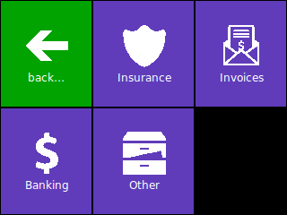

# PiMenu

This is a simple fullscreen menu system written in Python TKInter. It has been
developed with a Raspberry Pi Touchscreen in mind and is optimized for small
screens (320x240 is assumed).

The design is inspired by Windows 8's Metro design. Tiles are configured in
`config.json`

## Installation of the Pi-Menu

Under some operating systems, you might need to replace all python and pip commands with python3 and pip3

### Download the repo

If you have git installed, you can clone this repo with the command bellow

```
git clone https://github.com/sebastiengrd/pi-menu-E23.git
```

If you don't have git, you can simply go to https://github.com/sebastiengrd/pi-menu-E23 , click on "Code", "Download Zip" and extract the zip file in your computer.

### Go in the repo with a terminal

Open a terminal (cmd on Windows), and go into the project folder that you just downloaded with

```
cd Insert-Path/pi-menu-E23/
```

### Install the virtual environment

1. If you don't have Python, install the latest version of Python on your operating system

2. Install virtualenv with the command

```
python -m pip install --user virtualenv"
```

3. Create a new environment with "virtualenv venv" 4. Activate environment

- Linx/Mac :

```
source venv/bin/activate
```

- Windows :

```
venv/Scripts\activate
```

4. Install required libraries with

```
pip install -r requirements.txt
```

### Install other required dependencies

If you are on Linux (maybe on mac), you will need to install tkinter. This can be done with

```
sudo apt-get install python3-tk
```

### Start Pi-Menu

Once everything is installed, you can start the app with

```
python pimenu.py
```



## License

Copyright (c) 2014-2017 Andreas Gohr

Permission is hereby granted, free of charge, to any person obtaining a copy
of this software and associated documentation files (the "Software"), to deal
in the Software without restriction, including without limitation the rights
to use, copy, modify, merge, publish, distribute, sublicense, and/or sell
copies of the Software, and to permit persons to whom the Software is
furnished to do so, subject to the following conditions:

The above copyright notice and this permission notice shall be included in
all copies or substantial portions of the Software.

THE SOFTWARE IS PROVIDED "AS IS", WITHOUT WARRANTY OF ANY KIND, EXPRESS OR
IMPLIED, INCLUDING BUT NOT LIMITED TO THE WARRANTIES OF MERCHANTABILITY,
FITNESS FOR A PARTICULAR PURPOSE AND NONINFRINGEMENT. IN NO EVENT SHALL THE
AUTHORS OR COPYRIGHT HOLDERS BE LIABLE FOR ANY CLAIM, DAMAGES OR OTHER
LIABILITY, WHETHER IN AN ACTION OF CONTRACT, TORT OR OTHERWISE, ARISING FROM,
OUT OF OR IN CONNECTION WITH THE SOFTWARE OR THE USE OR OTHER DEALINGS IN
THE SOFTWARE.

## Icons

The install comes wih a bunch of icons with their own licenses as listed below:

- bunny.gif CC-by http://thenounproject.com/term/rabbit/26062/
- invoice.gif CC-by http://thenounproject.com/term/invoice/60884/
- ambulance.gif PD http://thenounproject.com/term/ambulance/597/
- medical.gif CC-by http://thenounproject.com/term/medical/35773/
- grave.gif CC-by http://thenounproject.com/term/grave/29403/
- fish.gif CC-by http://thenounproject.com/term/fish/19775/
- all others CC-by http://modernuiicons.com/
